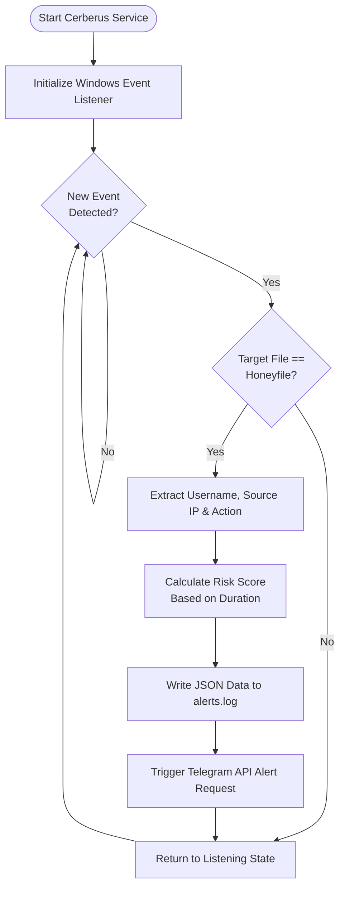
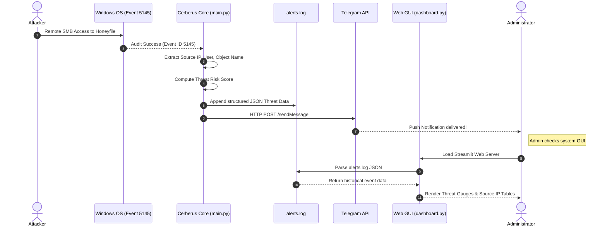

# 🐺 Project Cerberus: Endpoint Deception & Honeyfile Intrusion Detection System

[](https://www.python.org/)
[](https://opensource.org/licenses/MIT)
[](https://microsoft.com/windows)
[](https://streamlit.io/)

**Project Cerberus** is an advanced, enterprise-grade **deception-based security agent** for Windows endpoints. Named after the mythical three-headed guardian of the underworld, Cerberus guards your sensitive directories by deploying high-fidelity **honeyfiles** (decoy documents) and monitoring them across multiple threat vectors in real-time. 

When an adversary, malicious script, or ransomware touches these files—locally or over the network (SMB)—Cerberus instantly calculates the risk score, registers forensic telemetry, logs the activity, and dispatches **rich interactive alerts directly to your Telegram** while displaying live threat data on a **cyber-themed Streamlit analytics dashboard**.

---

## 🏗️ Architectural Overview & Workflow

Cerberus operates by combining filesystem auditing, low-level Win32 API window tracking, background keyboard listeners, and Windows Security Event Log analysis to form a unified deception shield.



### 1. Unified Threat Sequence (Remote SMB Access example)


---

## ⚡ Key Features

*   **🛡️ Multi-Drive Watchdog Monitoring:** Watches over primary and secondary drives recursively, instantly detecting file actions (`OPENED`, `MODIFIED`, `MOVED`, `COPIED`, `DELETED`, `RENAMED`).
*   **📡 Shared-File Network Auditing (Event ID 5145):** Seamlessly enables system-wide Share Access Auditing to catch adversaries probing honeyfiles over port 445 (SMB) from remote network endpoints.
*   **🖥️ Low-Level Window Tracker (`win32gui`):** Tracks window titles in real-time to log exact file viewing/editing durations, enabling accurate threat severity calculations.
*   **⌨️ Background Typing Interceptor (`pynput`):** Hooks keypress activity inside open honeyfile applications, signaling active modification or exfiltration.
*   **🔗 Automatic Windows Startup Registry:** Self-registers to the standard user run registry (`Software\Microsoft\Windows\CurrentVersion\Run`) to survive reboots silently via `pythonw.exe`.
*   **⚙️ Self-Elevating UAC Execution:** Checks for administrative privileges at startup and cleanly triggers UAC prompt relaunch if higher rights are needed to audit network events.
*   **💾 Auto-Generated High-Fidelity Decoy Files:** Dynamically spins up authentic Excel sheets (`.xlsx`), Word documents (`.docx`), PowerPoint presentations (`.pptx`), PDF reports (`.pdf`), and zipped archives (`.zip`) using `openpyxl`, `fpdf`, `pptx`, and `docx` fallback handlers.
*   **🚨 Interactive Telegram Alerts:** Delivers detailed, HTML-styled alert messages instantly containing the target file, action taken, severity level, absolute path, and source IP address.
*   **📊 Mission Control Dashboard:** A custom, dark-cyber themed Streamlit web console featuring real-time KPI metrics, interactive Plotly scatterplots for threat timelines, horizontal bar charts for top source IPs, and filterable forensic logs.

---

## 🔧 Installation & Technical Requirements

### Prerequisites
*   **Operating System:** Windows 10 or 11 (requires Administrator access for advanced SMB audit logging).
*   **Python:** Version 3.8 or higher.

### Step 1: Install Dependencies
Install all required libraries via pip:
```bash
pip install watchdog pynput pywin32 psutil streamlit pandas plotly openpyxl fpdf python-pptx python-docx python-dotenv
```

### Step 2: Configure Telegram Alerts (`.env`)
Create a file named `.env` in the project root directory (you can copy `.env.example` as a starting point) and add your credentials:
```env
TELEGRAM_BOT_TOKEN="your_bot_token_here"
TELEGRAM_CHAT_ID="your_chat_id_here"
```
> 💡 *Note: To generate a token, message [@BotFather](https://t.me/BotFather) on Telegram. To get your chat ID, search for [@userinfobot](https://t.me/userinfobot) or use a bot like [@RawDataBot](https://t.me/RawDataBot).*

---

## 🚀 Running the System

### 1. Launch the Deception Agent
Run the main script in an elevated PowerShell/Command Prompt:
```bash
python main.py
```
*   The script will automatically request Admin UAC elevation if not already elevated.
*   It generates all dummy files specified in the configuration (e.g., `passwords.txt`, `confidential.docx`, `employee_salaries.pdf`) in the `honeyfiles/` directory and on the `D:` drive.
*   It registers itself to run silently on startup.

### 2. Launch the Mission Control Dashboard
In a separate terminal, launch the Streamlit server:
```bash
streamlit run dashboard.py
```
This opens the elegant **cyber-themed dashboard** at `http://localhost:8501`, polling `alerts.log` every 5 seconds to visualize intrusions.

---

## 🗃️ Codebase Structure

```
Project_CerBerus/
│
├── honeyfiles/                   # Target decoy directory (auto-generated)
├── logs/                         # Incident history directory
│   └── alerts.log                # Primary forensic JSON log
│
├── main.py                       # Deception Core & Event Monitors
├── dashboard.py                  # Streamlit Forensic Control Center
├── setup_autostart.ps1           # Optional PowerShell startup orchestrator
├── .gitignore                    # Custom ignore list (excludes .env & logs)
├── .env.example                  # Template configuration file
└── README.md                     # Documentation (this file!)
```

---

## ⚖️ License & Disclaimer

This project is licensed under the MIT License. 

**Disclaimer:** Project Cerberus is designed for defensive security research, local network monitoring, and endpoint threat intelligence gathering. Make sure you possess proper authorization before deploying files, share audits, or monitoring services on target environments.
